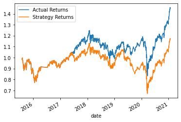

# Challenge_14
 In this module, we learned how to develop trading algorithm with some of the well-known technical indicators. 
 In this practice we used different machine learning techniques to classify our data points to signal buying or selling by using simple moving average of the percentage returns as the features of the model.

## Installation Guide
We need to first install the following dependencies.

```python
    import pandas as pd
    import numpy as np
    from pathlib import Path
    import hvplot.pandas
    import matplotlib.pyplot as plt
    from sklearn import svm
    from sklearn.preprocessing import StandardScaler
    from pandas.tseries.offsets import DateOffset
    from sklearn.metrics import classification_report

```

---

##  Summary Evaluation Method
We initially used the short window of SMA to be 4 periods and the long window to be 100 periods. Then we used the first three month of the data to train our model for being used in the SVM classifier. We made a graph to compare the return of  strategy developed by the model with the actual return. 
Here is the results:

 


We changed the classifier from SVM to Logistic regression and we made the same plot. Here is the results:


We tuned the training algorithm by adjusting the size of the training dataset, and this time using the first 4 month of the data to train our SVM model. Here is the resulting plot:


In the next step, we changed the short and the long window of SMA and with that changed our features. Here is the resulting plot:



## Total Cumulative Return
 Original SVM	   0.761652     
 Original LR     0.730676    
 Tuned Training 	0.578582    
 Tuned Features	0.385827    
 Actual Return	0.610014    
 Tuned features	0.385827  
   

## Conclusion
By looking at the graphs, the models that are using the original parameters, outperform the ones with the tuned parameters. Looking at the ultimate cumulative returns shows that SVM classification provides a more lucrative algorithm.
